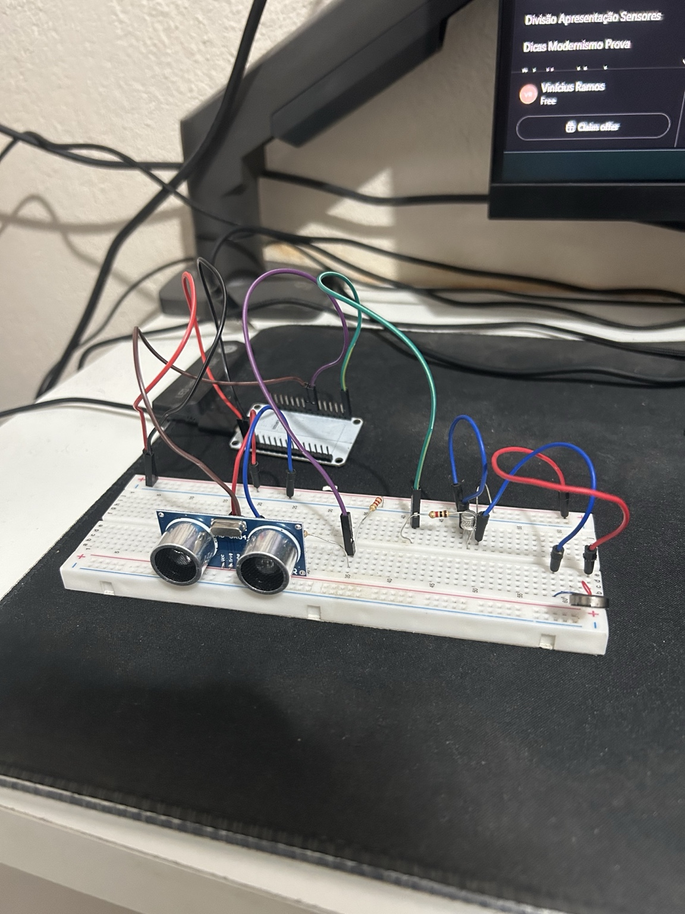

# VibraSight

## Overview

VibraSight is a low-cost smart cane designed to help visually impaired people detect obstacles and improve mobility safety through haptic feedback and ultrasonic sensing.

The project was inspired by accessibility challenges commonly found in Brazilian urban environments, especially in cities like São Paulo, where public spaces, transportation systems, and sidewalks are often not fully adapted for visually impaired people.

Unlike traditional canes, VibraSight aims to detect not only ground-level obstacles, but also elevated objects such as signs, branches, and poorly positioned urban structures that may represent safety risks.

The system is based on affordable, accessible components, focusing on low-cost implementation without sacrificing usability or user autonomy.

---

## Project Status

Current stage: functional prototype under development and testing.

---

## Problem Definition

Visually impaired people face a high risk of collisions during daily mobility, especially with obstacles positioned above the detection range of traditional canes. These collisions may cause injuries, falls, and reduced independence.

Although assistive technologies already exist, many solutions are financially inaccessible in the Brazilian context, often costing more than R$500. In addition, several devices rely mainly on audio alerts, which may become ineffective in noisy environments or uncomfortable for users who prefer tactile feedback.

This project aims to bridge the gap between accessibility, affordability, and safety by providing a practical, low-cost, and intuitive mobility assistance solution.

---

## Current Features

- Ultrasonic obstacle detection
- Haptic feedback using vibration motors
- ESP32-based control system
- Low-cost hardware architecture

---

## Future Improvements

- Elevated obstacle detection
- Modular architecture
- Improved power management
- Compact and resistant enclosure
- Smarter vibration feedback system

## Prototype

First functional prototype using ESP32, ultrasonic sensing, and haptic feedback.

